# Práctica 1. Preparación de las herramientas
Realizada por Elena María Gómez Ríos y Guillermo Sandoval Schmidt.

## Objetivos
- Acceder por ssh de una máquina a otra.
- Acceder mediante la herramienta curl desde una máquina a la otra.

## Instalación
Para las prácticas hemos utilizado el software de virtualización VirtualBox.

Primero hemos realizado la instalación de 2 máquinas virtuales con Ubuntu Server 16.04 LTS, OpenSSH Server y LAMP Server tal y como se indica en el guión de prácticas. A estás máquinas las hemos llamado M1 y M2.

Al comprobar las IP de ambas máquinas observamos que VirtualBox les ha dado la misma dirección IP por lo que necesitamos cambiarlas manualmente, en mi caso la IP de la máquina M1 la establezco de forma estática a 10.0.2.16.

## Configuración del adaptador de red
Para que haya visibilidad entre todas las máquinas virtuales y el anfitrión hemos creado una nueva interfaz de red en VirtualBox con la siguiente configuración. Realizamos la misma configuración para ambas máquinas.

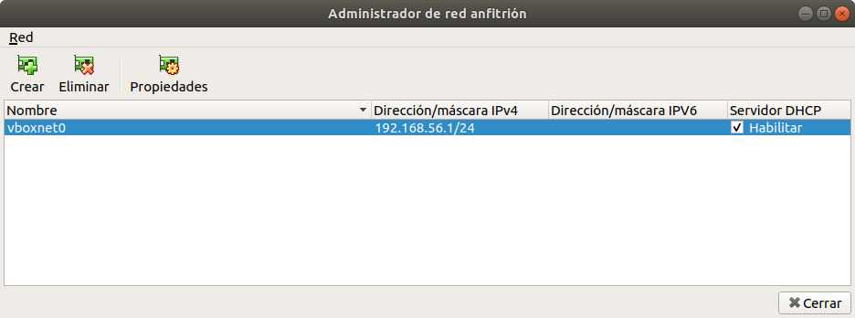

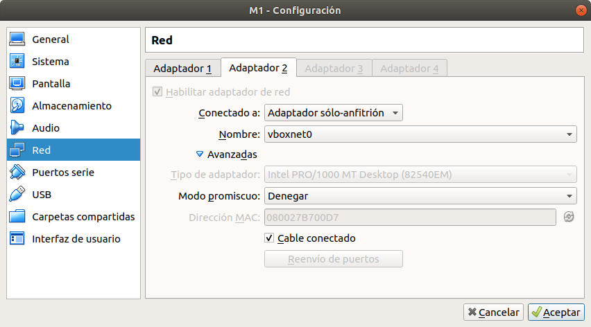

Una vez creado el adaptador de red, accedemos a las máquinas para cambiar la IP interna a fija y establecer una nueva interfaz de red que se utilizará para conectar las máquinas entre sí y con el host. El archivo de configuración que debemos modificar es `/etc/network/interfaces`. En las siguientes imágenes muestro el estado final del archivo de ambas máquinas con la configuración aplicada.

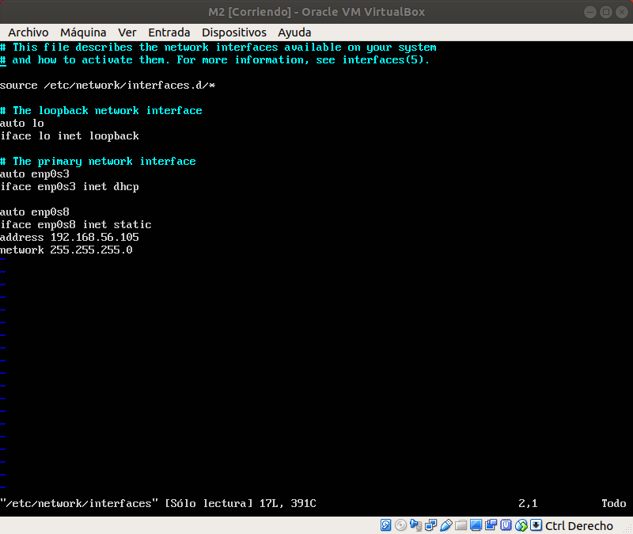

Mediante el comando `ifconfig` comprabamos que la configuración que hemos realizado se ha aplicado correctamente.

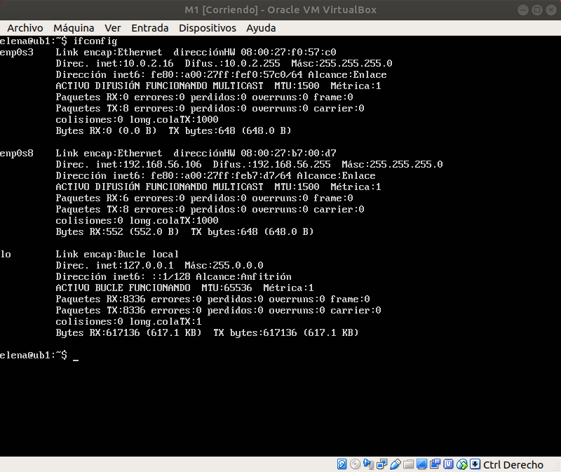

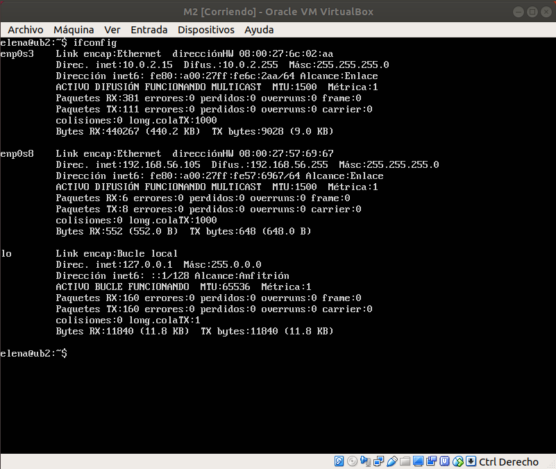

## Comprobación del funcionamiento
Para comprobar que las máquinas se ven entre sí podemos hacerlo con el comando `ping`.

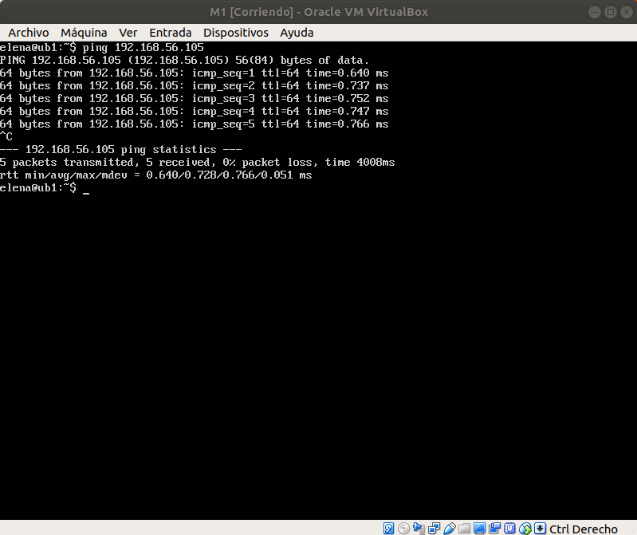

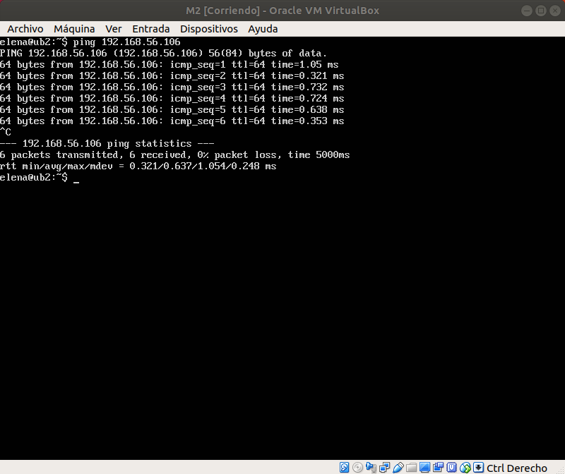

### Acceder mediante ssh de una máquina a otra
Para acceder mediante ssh tenemos que poner el siguiente comando: `ssh <IP_destino> -l <nombre_usuario>`. Con la opción `-l` podemos conectarnos directamente al usuario indicado.

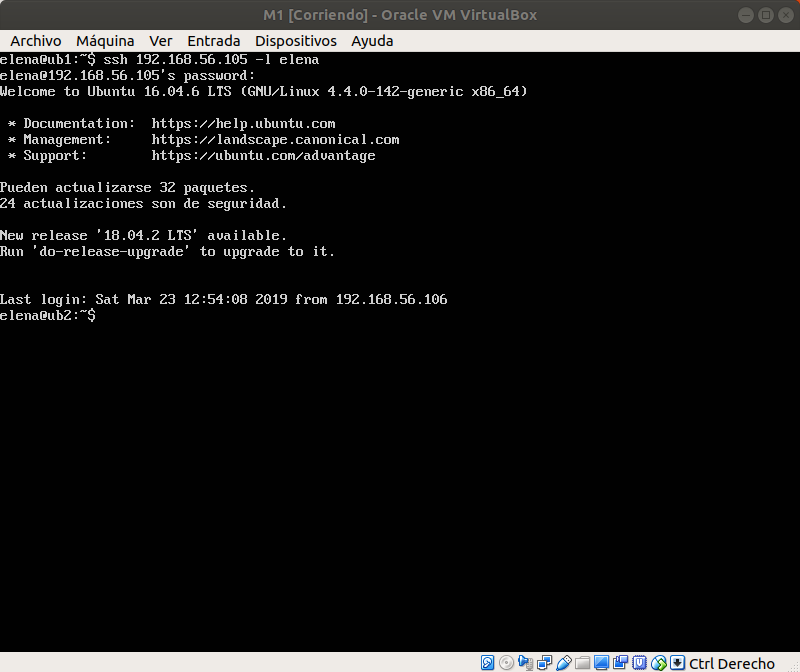

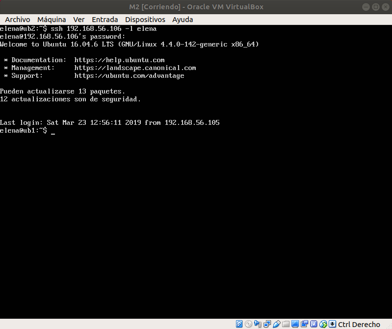

### Acceder mediante la herramienta curl desde una máquina a la otra
Creamos un archivo html en el directorio `/var/www/html` llamado `hola.html` en la máquina 1 y accedemos a él desde el anfitrión y desde la máquina 2 mediante curl.

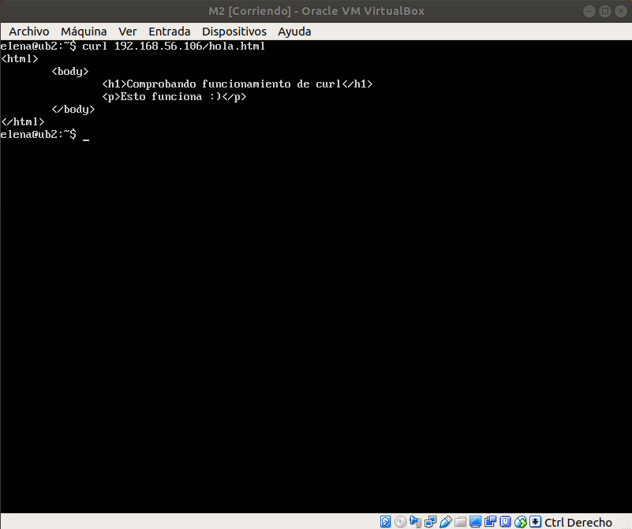

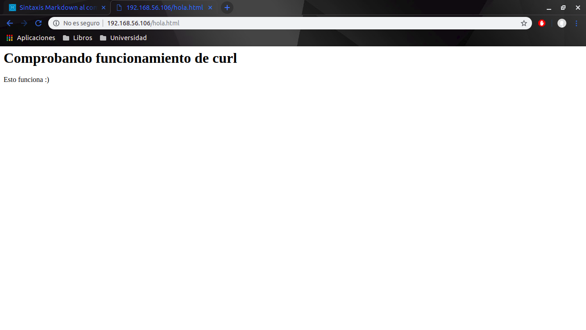
