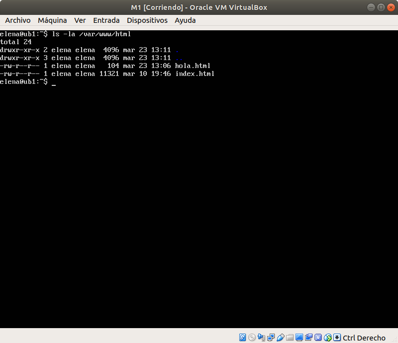
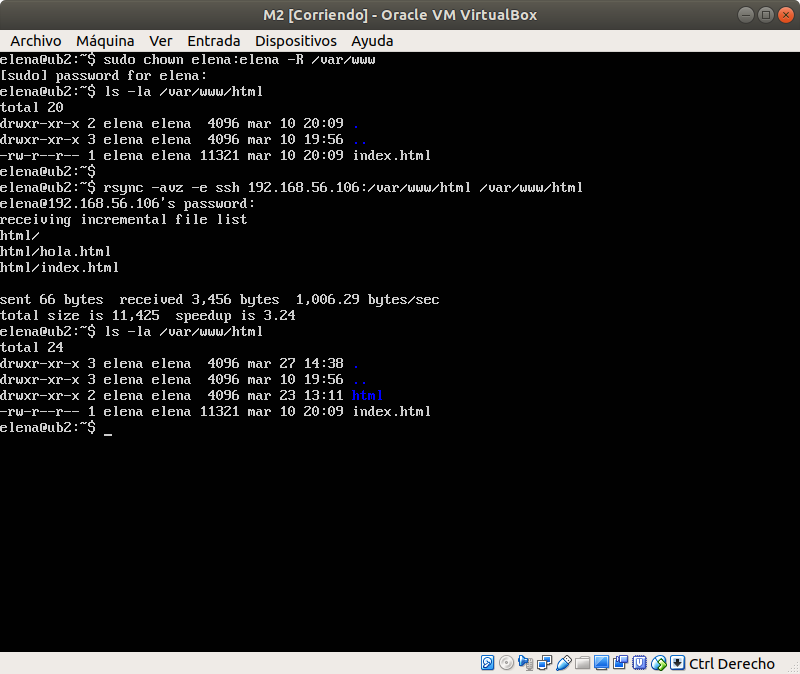
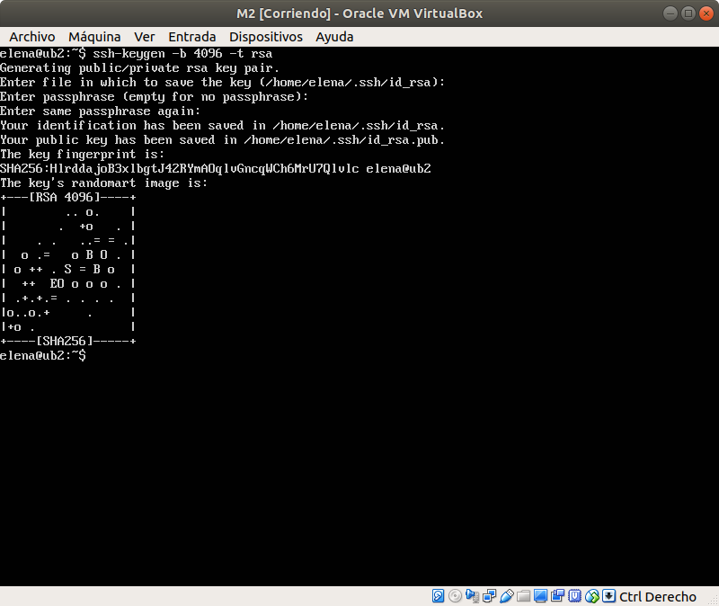
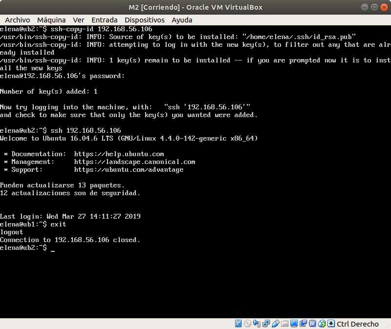
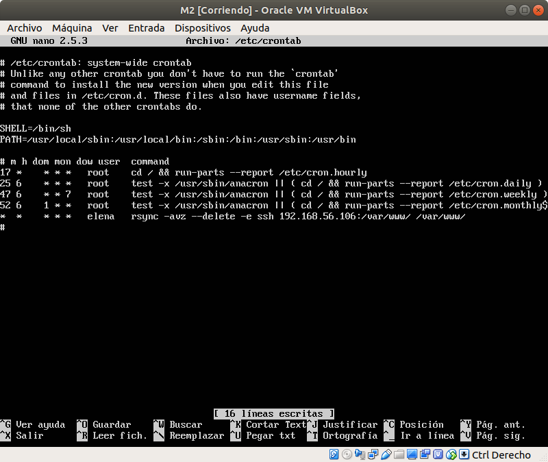
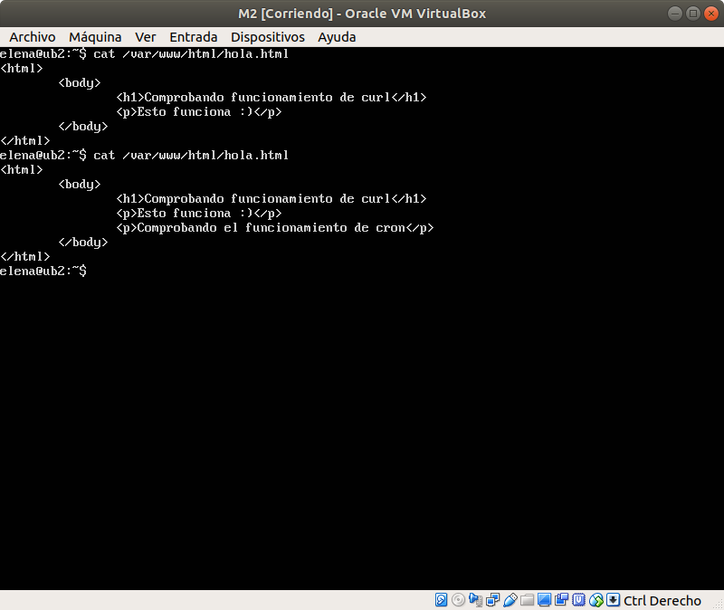

# Practica 2. Clonar la información de un sitio web.
Realizada por Elena María Gómez Ríos y Guillermo Sandoval Schmidt.

## Objetivos
- Aprender a copiar archivos mediante `ssh`.
- Clonar contenido entre máquinas.
- Configurar el `ssh` para acceder a máquinas remotas sin contraseña.
- Establecer tareas en `cron`.

## Instalar la herramienta rsync
En nuestro caso ya está instalado en las máquinas, si no lo estuviese tendríamos que instalarlo mediante `sudo apt-get install rsync`.

Tenemos que dar permisos a la carpeta `/var/www` al usuario en ambas máquinas:  
`sudo chown elena:elena –R /var/www`

Para probar el funcionamiento de `rsync` hemos clonado la carpeta `/var/www/html` de la máquina 1 a la máquina 2 ejecutando el comando:  
`rsync -avz -e ssh 192.168.56.106:/var/www/html /var/www/html`  
haciendo un `ls -la /var/www/html` vemos como se ha clonado la información de la máquina 1 a la máquina 2.





## Acceso sin contraseña para ssh
Para poder acceder de una máquina a la otra a través de `ssh` sin contraseña vamos a generar un par de claves pública-privada. Mediante `ssh-keygen` podemos generar la clave, con la opción -t para indicar el tipo de clave.

Por lo tanto generamos una clave en la máquina M2 con el siguiente comando:  
`ssh-keygen -b 4096 -t rsa`  



Una vez se ha generado la clave tenemos que copiarla desde la máquina M2 a la máquina M1. Para hacer la copia usaremos el comando `ssh-copy-id` que viene integrado en el comando `ssh`. Por lo tanto el comando dando la IP de la máquina M1 quedaría de la siguiente forma: `ssh-copy-id 192.168.56.106`.

En la siguiente imagen se puede comprobar como ahora el `ssh` no nos pide contraseña.



## Programar tareas con crontab
Con `crontab` podemos automatizar lo anterior añadiendo la siguiente línea al archivo `/etc/crontab` con la frecuencia que se desea, en mi caso cada minuto:  
```
# m h dom mon dow user	command
* * * * * elena rsync -avz --delete -e ssh 192.168.56.106:/var/www/ /var/www/
```



Para comprobar el funcionamiento vamos a modificar el archivo hola.html en la máquina M1 y ver si se modifica en la máquina M2.



Como se puede observar en la imagen se ha añadido correctamente la línea nueva en la máquina M2, por lo tanto `crontab` está funcionando correctamente.
