# Practica 4. Asegurar la granja web
Realizada por Elena María Gómez Ríos y Guillermo Sandoval Schmidt.

## Objetivos
El objetivo de esta práctica es llevar a cabo la configuración de seguridad de la granja web. Para ello, llevaremos a cabo las siguientes tareas:
- Instalar un certificado SSL para configurar el acceso HTTPS a los servidores.
- Configurar las reglas del cortafuegos para proteger la granja web.

## Instalar un certificado SSL autofirmado para configurar el acceso por HTTPS
Primero vamos a generar el certificado en la máquina M1, por lo que debemos activar el módulo SSL en Apache, generar los certificados y especificarle la ruta a los certificados en la configuración. Para ellos seguiremos los pasos indicados en el guión:


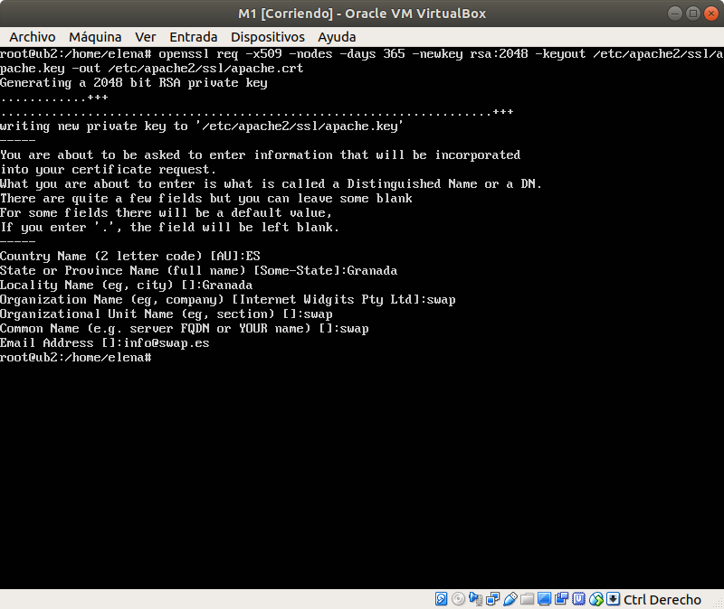

Editamos el archivo de configuración `/etc/apache2/sites-available/default-ssl.conf` y agregamos las siguientes líneas donde pone SSLEngine on:

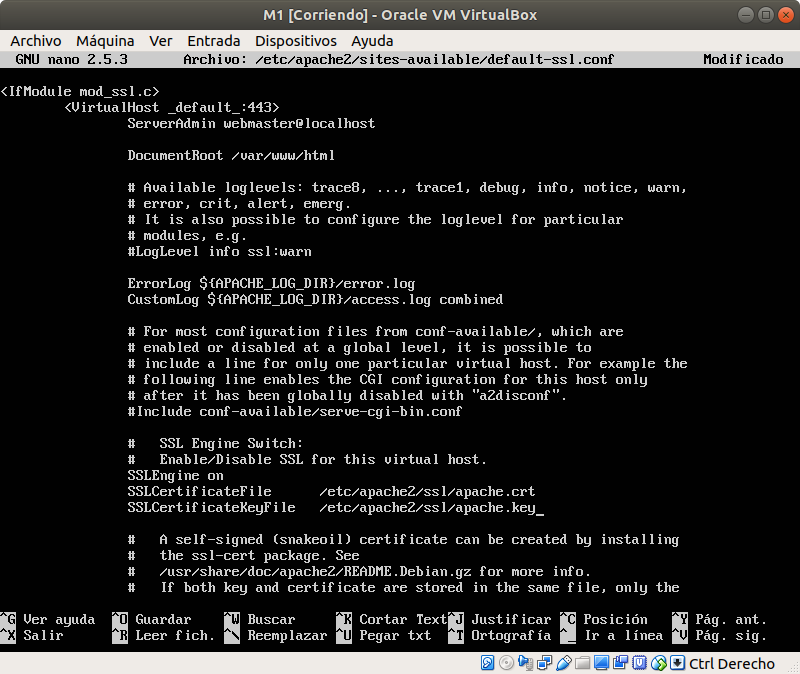

Activamos el sitio default-ssl y reiniciamos apache:

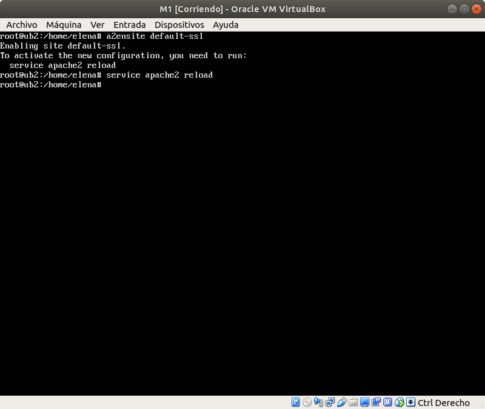

Comprobamos que funciona correctamente:

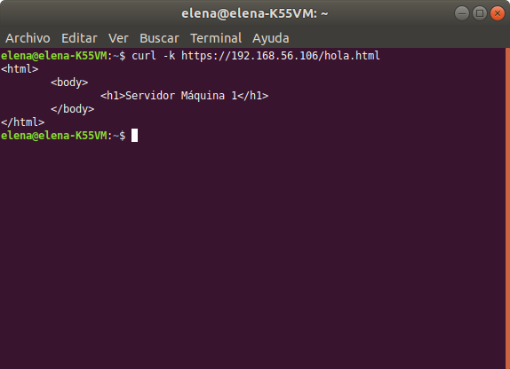

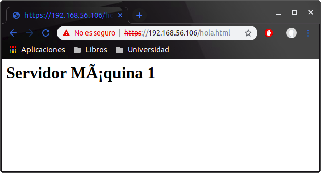

Para que la granja web nos permita usar el HTTPS debemos configurar el balanceador para que también acepte este tráfico (puerto 443). Para ello copiaremos la pareja de archivos (el .crt y el .key) a todas las máquinas de la granja web con la herramienta rsync.

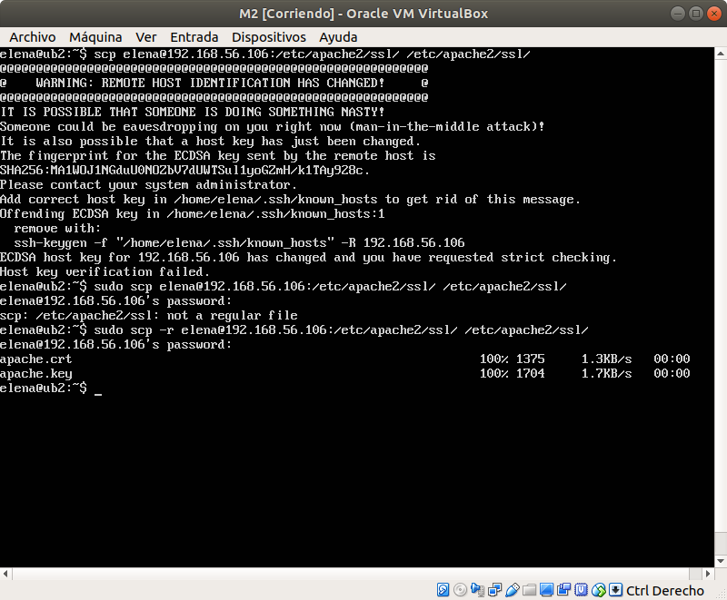

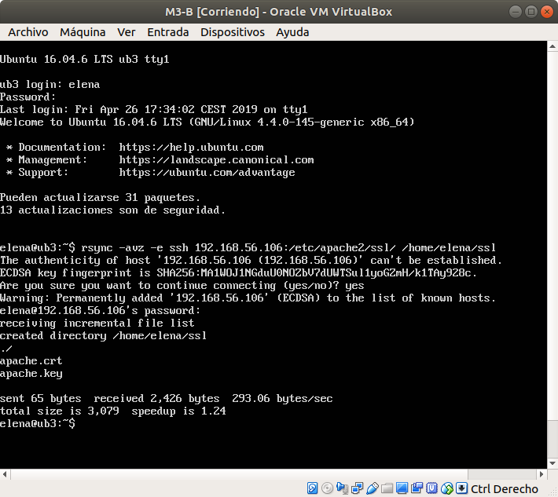

En el servidor M2 tenemos que activar el sitio default-ssl y reiniciar apache. En el balanceador nginx hemos añadido lo siguiente al archivo `/etc/nginx/conf.d/default.conf`:

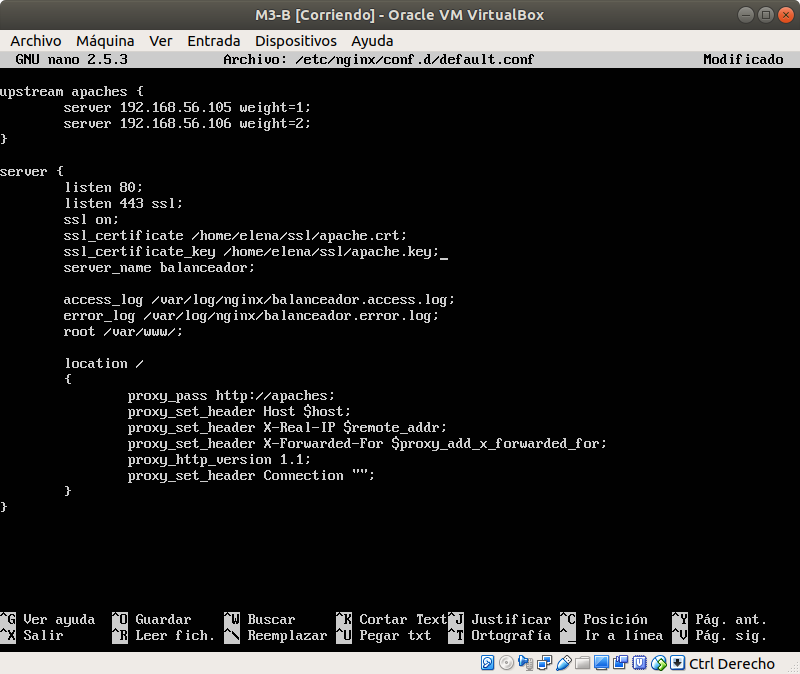

Comprobamos mediante curl que funciona correctamente:


## Configuración del cortafuegos
Para la configuración del cortafuegos en la máquina M1 voy a crear un script, llamado iptablesScript.sh en /home/elena/cortafuegos, que se ejecute en el arranque del sistema. El script es el siguiente:

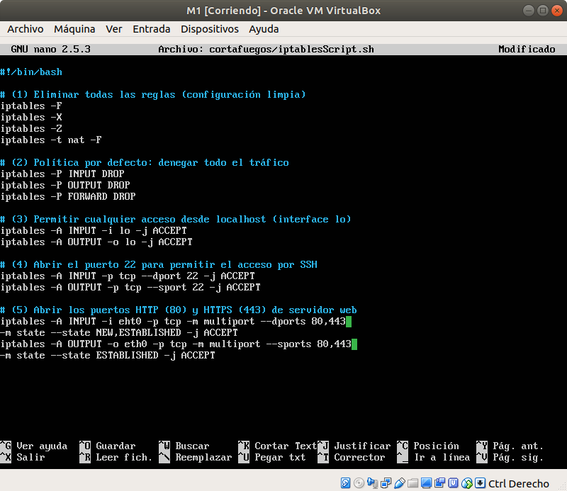

Ahora creamos y activamos un demonio que ejecutará el script, el demonio, llamado iptablesDaemon.service estará en /etc/systemd/system/ para que se ejecute en el arranque del sistema.

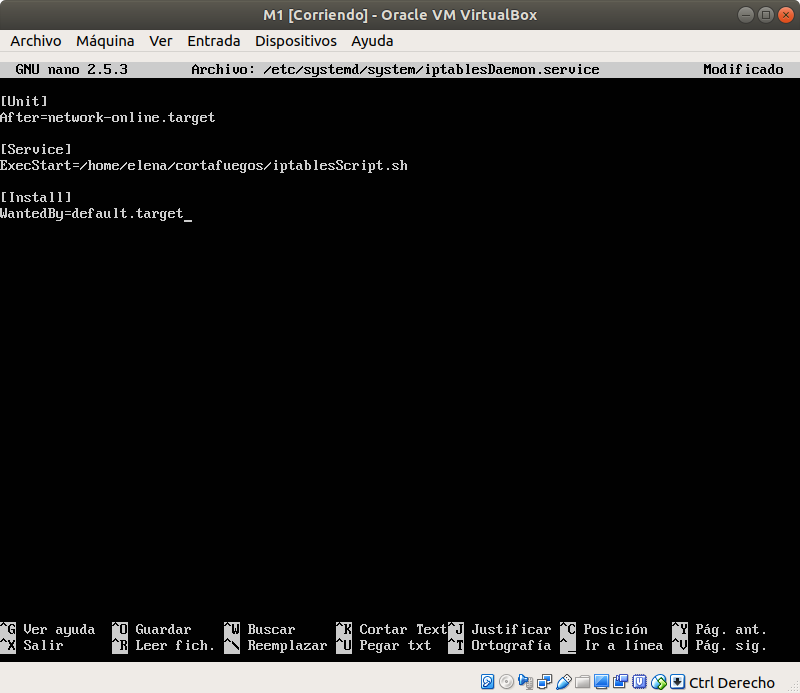

Para activar el demonio usamos los comandos
```
systemctl daemon-reload
systemctl enable iptablesDaemon.service
```
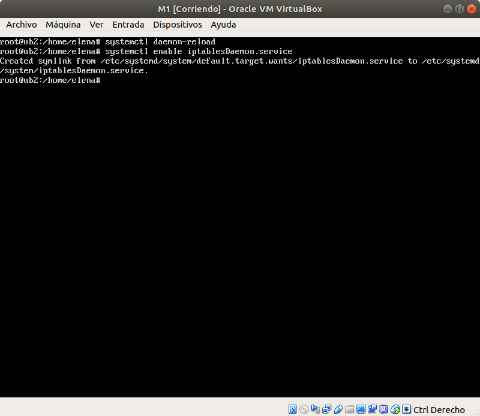

Ahora comprobamos que todo está correcto, después de reiniciar la máquina M1, comprobamos los puertos que están escuchando y la configuración del cortafuegos.


