# Practica 5. Replicación de bases de datos MySQL
Realizada por Elena María Gómez Ríos y Guillermo Sandoval Schmidt.

## Objetivos
En esta práctica el objetivo es configurar las máquinas virtuales para trabajar de forma que se mantenga actualizada la información en una BD entre dos servidores. Hay que llevar a cabo las siguientes tareas:
1. Crear una BD con al menos una tabla y algunos datos.
2. Realizar la copia de seguridad de la BD completa usando mysqldump en la máquina principal y copiar el archivo de copia de seguridad a la máquina secundaria.
3. Restaurar dicha copia de seguridad en la segunda máquina (clonado manual de la BD), de forma que en ambas máquinas esté esa BD de forma idéntica.
4. Realizar la configuración maestro-esclavo de los servidores MySQL para que la replicación de datos se realice automáticamente.

## Crear una BD e insertar datos
Creamos la BD con MySQL en la máquina M1 e insertamos algunos datos:

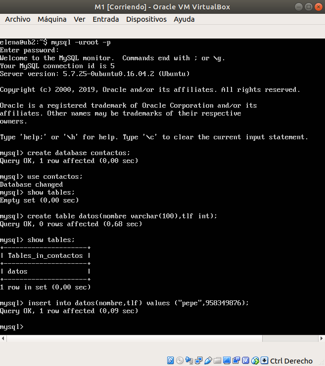

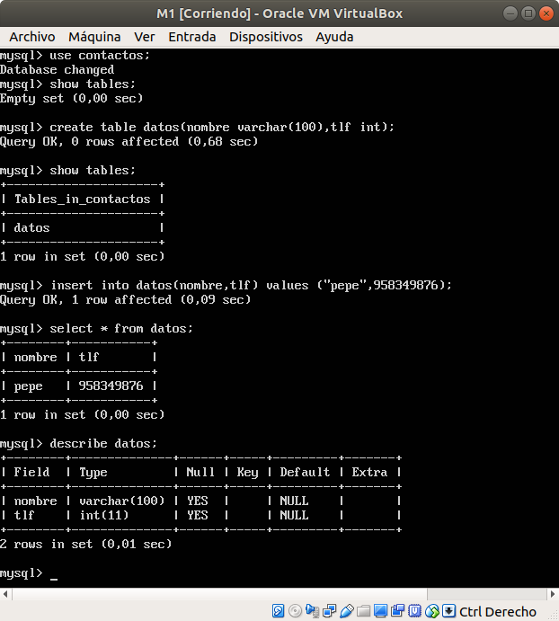

## Replicar una BD MySQL con mysqldump
Creamos la BD con MySQL en la máquina M2 para poder hacer la replica con mysqldump

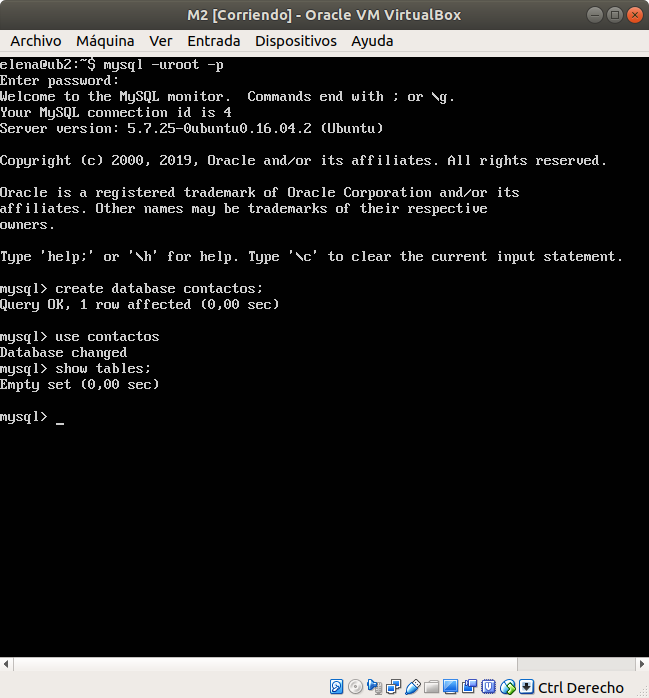

Primero tenemos que bloquear las tablas para evitar que se acceda a la BD para cambiar nada mientras se hace la copia de seguridad con el comando:
```
mysql> FLUSH TABLES WITH READ LOCK;
```
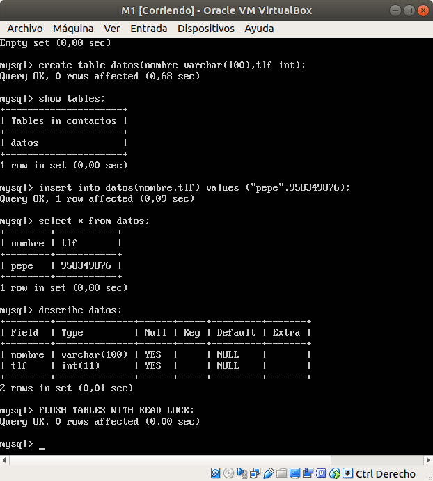

Ahora ya sí podemos hacer el mysqldump para guardar los datos. En el servidor principal (M1) hacemos:
```
mysqldump contactos -u root -p > /tmp/contactos.sql
```
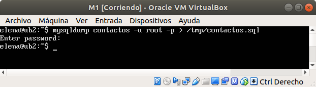

Como habíamos bloqueado las tablas, debemos desbloquearlas (quitar el “LOCK”):
```
mysql> UNLOCK TABLES;
```
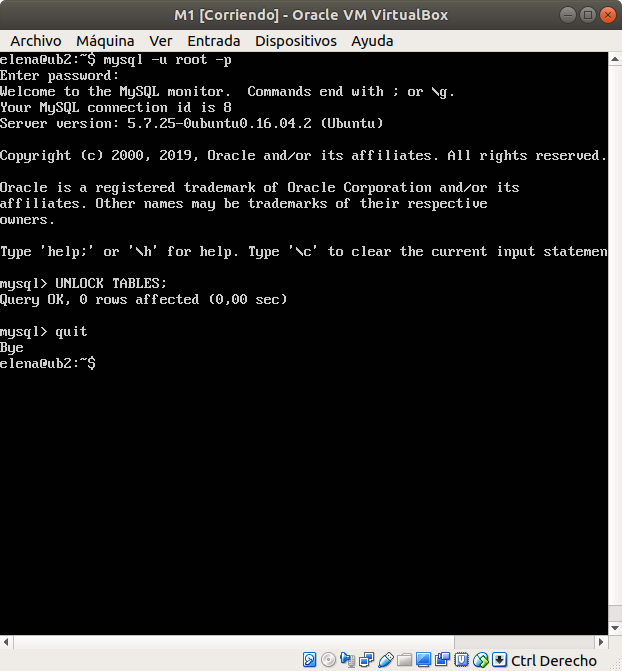

Ahora vamos a la máquina esclavo, M2, para copiar el archivo .SQL de la máquina M1:
```
scp maquina1:/tmp/contactos.sql /tmp/
```
Con esto habremos copiado desde la máquina principal (M1) a la máquina secundaria (M2) los datos que hay almacenados en la BD.

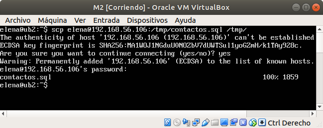

Ahora ejecutamos el archivo sql para crear la copia:
```
mysql -u root -p contactos < /tmp/contactos.sql
```
Comprobamos si las tablas son iguales, y como se puede ver en la imagen todo está correcto.

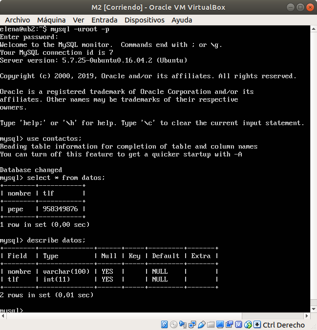

## Replicación de BD mediante una configuración maestro-esclavo

Lo primero que debemos hacer es editar el archivo de configuración de mysql, `/etc/mysql/mysql.conf.d/mysqld.cnf` tanto en el maestro como en el esclavo.
Comentamos el parámetro bind-address que sirve para que escuche un servidor:
```
#bind-address 127.0.0.1
```
Indicamos donde almacenar el log de errores:
```
log_error = /var/log/mysql/error.log
```
Establecemos el identificador del servidor:
```
server-id = 1  // para el caso del maestro
server-id = 2  // para el caso del esclavo
```
El registro binario:
```
log_bin = /var/log/mysql/bin.log
```

Guardamos el documento y reiniciamos el servicio:
```
/etc/init.d/mysql restart
```
Se puede ver que no ha dado ningun error al reiniciar el servicio:
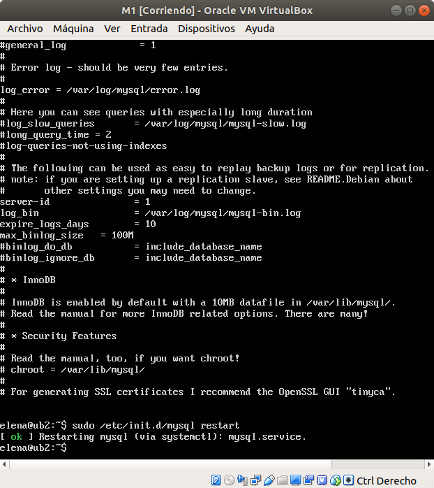

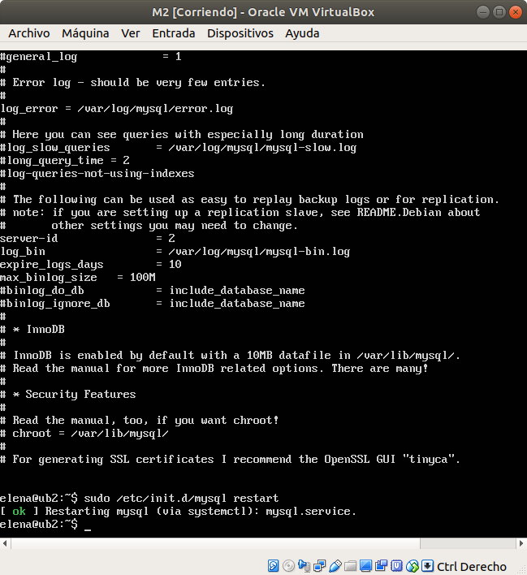

### Configuración del maestro
Volvemos al maestro para crear un usuario y darle permisos de acceso para la replicación. Entramos en mysql y ejecutamos las siguientes sentencias:
```
mysql> CREATE USER esclavo IDENTIFIED BY 'esclavo';

mysql> GRANT REPLICATION SLAVE ON *.* TO 'esclavo'@'%' IDENTIFIED BY 'esclavo';

mysql> FLUSH PRIVILEGES;

mysql> FLUSH TABLES;

mysql> FLUSH TABLES WITH READ LOCK;
```
Para finalizar con la configuración en el maestro, obtenemos los datos de la BD que vamos a replicar para posteriormente usarlos en la configuración del esclavo:
```
mysql> SHOW MASTER STATUS;
```
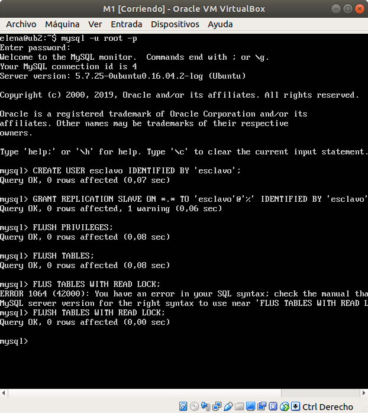

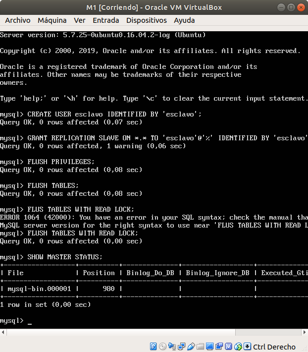

### Configuración del esclavo
Vamos al esclavo y ejecutamos lo siguiente:
```
mysql> CHANGE MASTER TO MASTER_HOST='192.168.56.106',
MASTER_USER='esclavo', MASTER_PASSWORD='esclavo',
MASTER_LOG_FILE='mysql-bin.000001', MASTER_LOG_POS=501,
MASTER_PORT=3306;
```
Por último, arrancamos el esclavo.
```
mysql> START SLAVE;
```
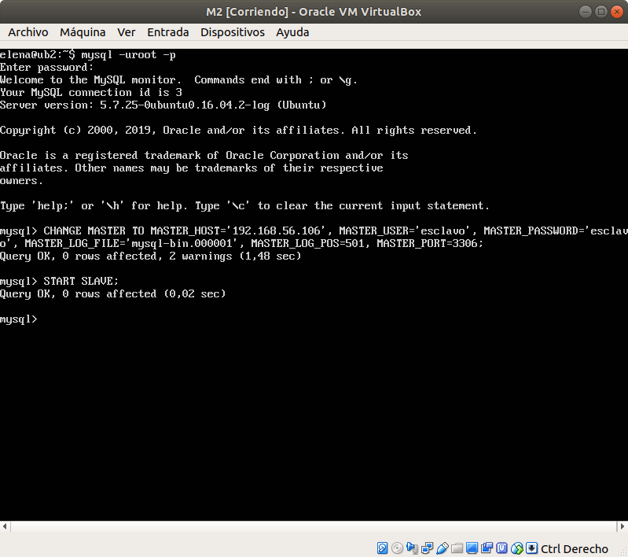

Por último vamos al maestro y volvemos a activar las tablas para que puedan meterse nuevos datos en el maestro:
```
mysql> UNLOCK TABLES;
```

### Comprobar funcionamiento
Comprobamos el estado del esclavo:
```
mysql> SHOW SLAVE STATUS\G
```
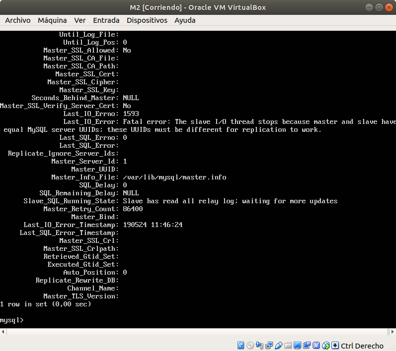

Como se puede observar el valor de Seconds_Behind_Master es null por lo que hay algún tipo de error. Vemos que el error es debido a que el esclavo tiene el mismo UUID que el servidor, esto es debido a que en prácticas anteriores tuvimos que generar la máquina M1 haciendo un clonado de la máquina M2.

Para resolverlo, simplemente tenemos que borrar el archivo /var/lib/mysql/auto.cnf y a continuación reiniciar el servicio de mysql.

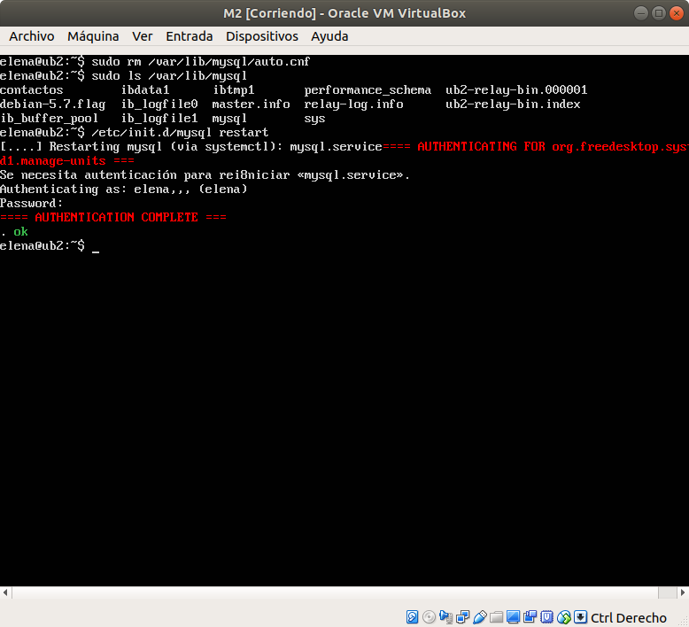

Volvemos a comprobamos el estado del esclavo:
```
mysql> SHOW SLAVE STATUS\G
```
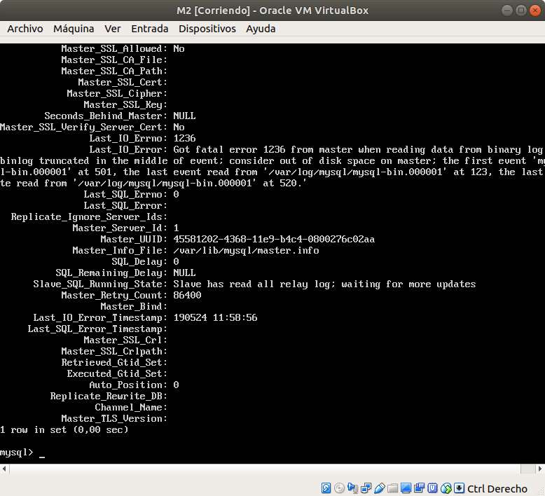

Este error es debido a que me equivoqué en la configuración del esclavo y no puse bien los datos de MASTER_LOG_FILE y MASTER_LOG_POS, lo he vuelto a realizar poniendo bien los datos y al comprobar ahora el estado del esclavo me da lo siguiente:

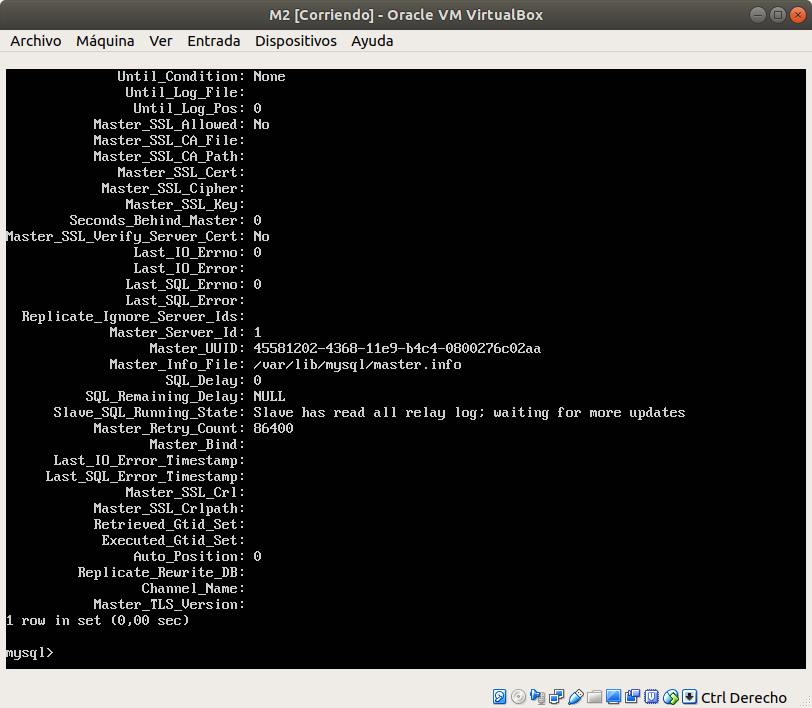

Por lo que todo parece estar correcto, para asegurarnos vamos a meter datos en el maestro y ver si se replican en el esclavo.

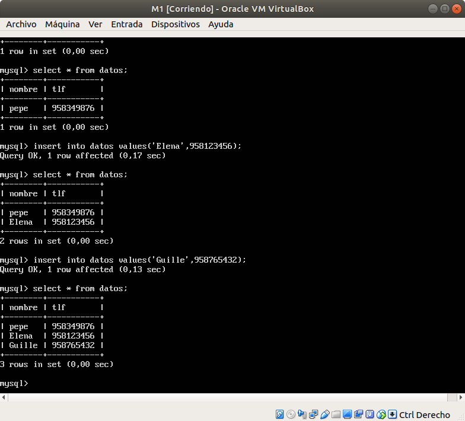

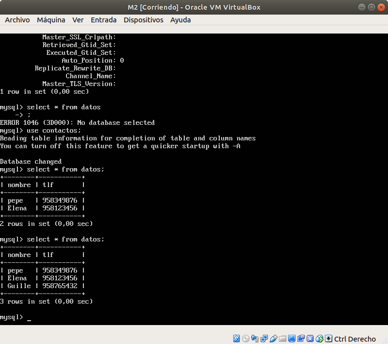

Como vemos los datos de la base de datos del maestro se van replicando correctamente al esclavo.
